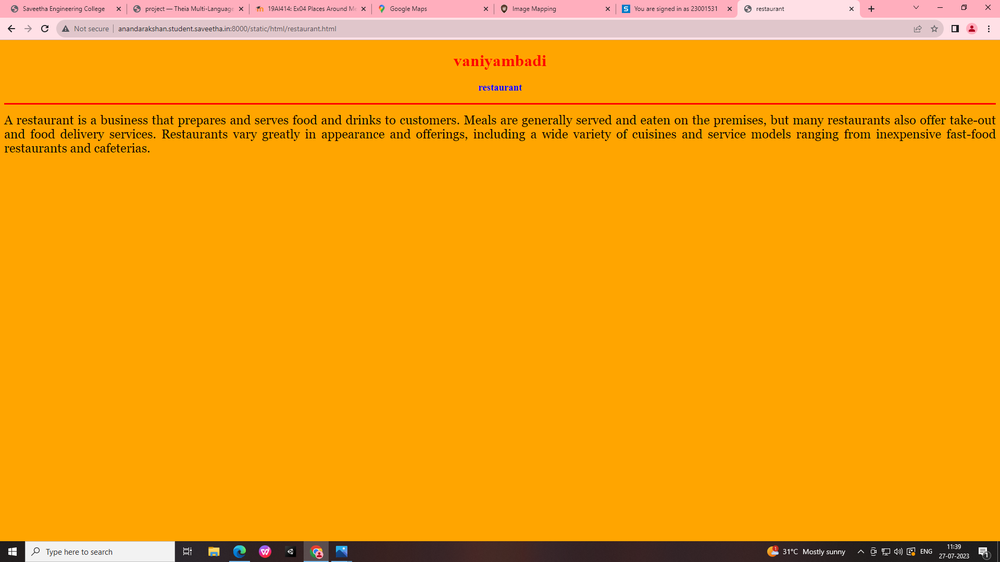
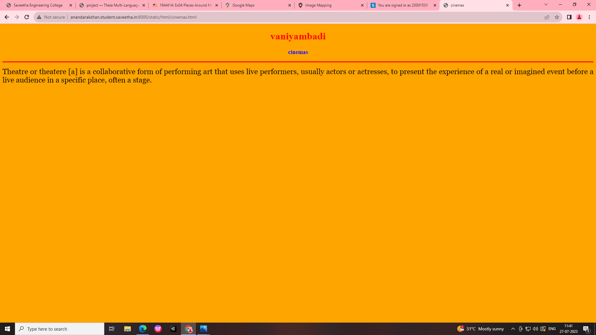
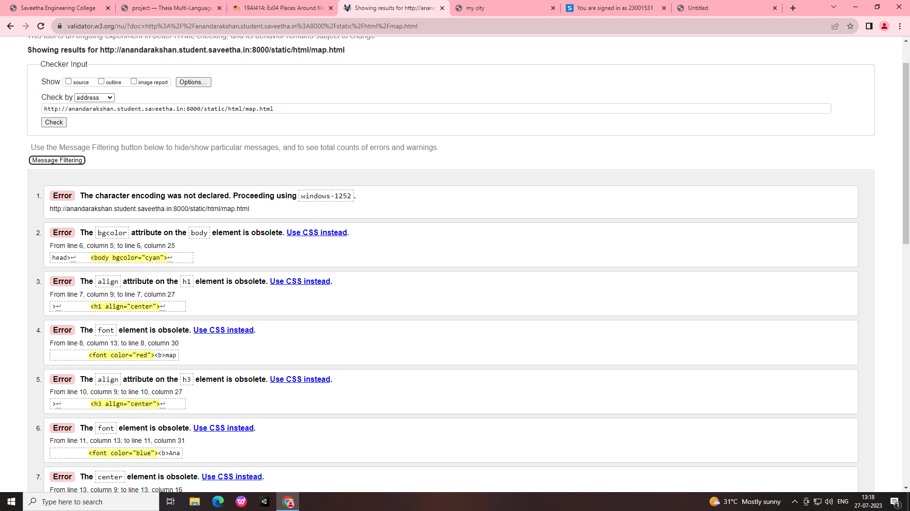
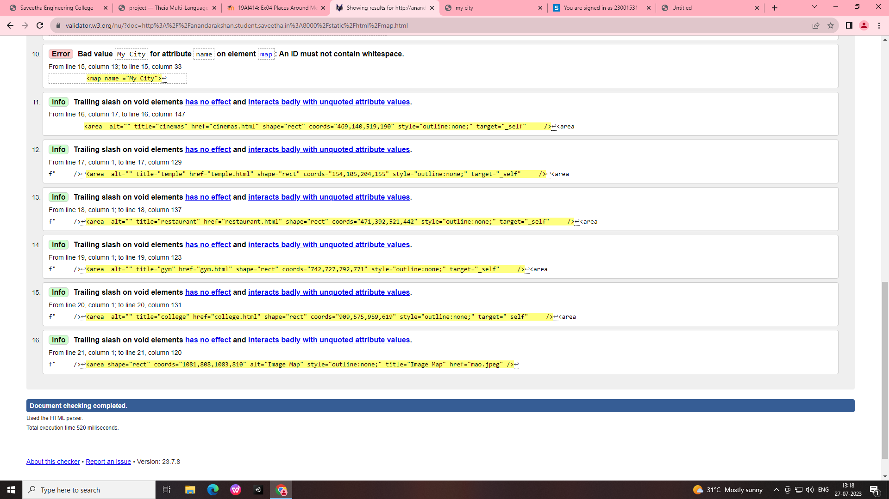

# Places Around Me
## AIM:
To develop a website to display details about the places around my house.

## Design Steps:

STEP 1
Create a Django admin interface.

STEP 2
Download your city map from Google.

STEP 3
Using <map> tag name the map.

STEP 4
Create clickable regions in the image using <area> tag.

STEP 5
Write HTML programs for all the regions identified.

STEP 6
Execute the programs and publish them.

## Code:
index.html
```py
<!DOCTYPE html>
<html>
    <head>
        <title>places around me</title>
    </head>
    <body>
        
<map name="image-maps-2023-07-27-055246" id="ImageMapsCom-image-maps-2023-07-27-055246">
<area  alt="" title="cinemas" href="cinemas.html" shape="rect" coords="469,140,519,190" style="outline:none;" target="_self"     />
<area  alt="" title="temple" href="temple.html" shape="rect" coords="154,105,204,155" style="outline:none;" target="_self"     />
<area  alt="" title="restaurant" href="restaurant.html" shape="rect" coords="471,392,521,442" style="outline:none;" target="_self"     />
<area  alt="" title="gym" href="gym.html" shape="rect" coords="742,727,792,771" style="outline:none;" target="_self"     />
<area  alt="" title="college" href="college.html" shape="rect" coords="909,575,959,619" style="outline:none;" target="_self"     />
<area shape="rect" coords="1081,808,1083,810" alt="Image Map" style="outline:none;" title="Image Map" href="mao.jpeg" />
</map>
    </body>
</html>
```
map.html
```py
<!DOCTYPE html>
<html lang="en">
    <head>
        <title>my city</title>
    </head>
    <body bgcolor="cyan">
        <h1 align="center">
            <font color="red"><b>map.html</b></font>
        </h1>
        <h3 align="center">
            <font color="blue"><b>Ananda Rakshan (23001531)</b></font>
        </h3>
        <center>
            
            <map name ="My City">
                <area  alt="" title="cinemas" href="cinemas.html" shape="rect" coords="469,140,519,190" style="outline:none;" target="_self"     />
<area  alt="" title="temple" href="temple.html" shape="rect" coords="154,105,204,155" style="outline:none;" target="_self"     />
<area  alt="" title="restaurant" href="restaurant.html" shape="rect" coords="471,392,521,442" style="outline:none;" target="_self"     />
<area  alt="" title="gym" href="gym.html" shape="rect" coords="742,727,792,771" style="outline:none;" target="_self"     />
<area  alt="" title="college" href="college.html" shape="rect" coords="909,575,959,619" style="outline:none;" target="_self"     />
<area shape="rect" coords="1081,808,1083,810" alt="Image Map" style="outline:none;" title="Image Map" href="mao.jpeg" />
            </map>
        </center>
    </body>
</html>
```
temple.html
```py
<!DOCTYPE html>
<html lang="en">
<head>
<title>Temple</title>
</head>
<body bgcolor="orange">
<h1 align="center">
<font color="red"><b>vaniyambadi</b></font>
</h1>
<h3 align="center">
<font color="blue"><b>Temple</b></font>
</h3>
<hr size="3" color="red">
<p align="justify">
<font face="Georgia" size="5">
    This Temple Was Constructed In 1929 By Sri Bhakta Narasimham. It Has A Spiritual Significance Among The People Of Machilipatnam. The Deity And The Garbhagriha Of The Temple Are Very Similar To Pandaripur Temple. An Idol Of Sri Abhayanjaneya Swami (An Incarnation Of Lord Hanuman) Is Installed In Front Of The Lord.
</font>
</p>
</body>
</html>
```
gym.html
```py
<!DOCTYPE html>
<html lang="en">
<head>
<title>gym</title>
</head>
<body bgcolor="orange">
<h1 align="center">
<font color="red"><b>vaniyambadi</b></font>
</h1>
<h3 align="center">
<font color="blue"><b>gym</b></font>
</h3>
<hr size="3" color="red">
<p align="justify">
<font face="Georgia" size="5">
    A gymnasium, also known as a gym, is an indoor location for athletics. The word is derived from the ancient Greek term "gymnasium". They are commonly found in athletic and fitness centers, and as activity and learning spaces in educational institutions. "Gym" is also slang for "fitness centre", which is often an area for indoor recreation. 
</font>
</p>
</body>
</html>
```
restaurant.html
```py
<!DOCTYPE html>
<html lang="en">
<head>
<title>restaurant</title>
</head>
<body bgcolor="orange">
<h1 align="center">
<font color="red"><b>vaniyambadi</b></font>
</h1>
<h3 align="center">
<font color="blue"><b>restaurant</b></font>
</h3>
<hr size="3" color="red">
<p align="justify">
<font face="Georgia" size="5">
    A restaurant is a business that prepares and serves food and drinks to customers. Meals are generally served and eaten on the premises, but many restaurants also offer take-out and food delivery services. Restaurants vary greatly in appearance and offerings, including a wide variety of cuisines and service models ranging from inexpensive fast-food restaurants and cafeterias.
</font>
</p>
</body>
</html>
```
college.html
```py
<!DOCTYPE html>
<html lang="en">
<head>
<title>college</title>
</head>
<body bgcolor="orange">
<h1 align="center">
<font color="red"><b>vaniyambadi</b></font>
</h1>
<h3 align="center">
<font color="blue"><b>college</b></font>
</h3>
<hr size="3" color="red">
<p align="justify">
<font face="Georgia" size="5">
    The College was started in 1919 and got recognition in July 1921. Islamiah College is known for its secular credentials from its very inception and holds a true national out-look.
</font>
</p>
</body>
</html>
```
cinemas.html
```py
<!DOCTYPE html>
<html lang="en">
<head>
<title>cinemas</title>
</head>
<body bgcolor="orange">
<h1 align="center">
<font color="red"><b>vaniyambadi</b></font>
</h1>
<h3 align="center">
<font color="blue"><b>cinemas</b></font>
</h3>
<hr size="3" color="red">
<p align="justify">
<font face="Georgia" size="5">
    Theatre or theatere [a] is a collaborative form of performing art that uses live performers, usually actors or actresses, to present the experience of a real or imagined event before a live audience in a specific place, often a stage.
</font>
</p>
</body>
</html>
```

## Output:






## HTML Validator:




## Result:
The program is completed successfully.